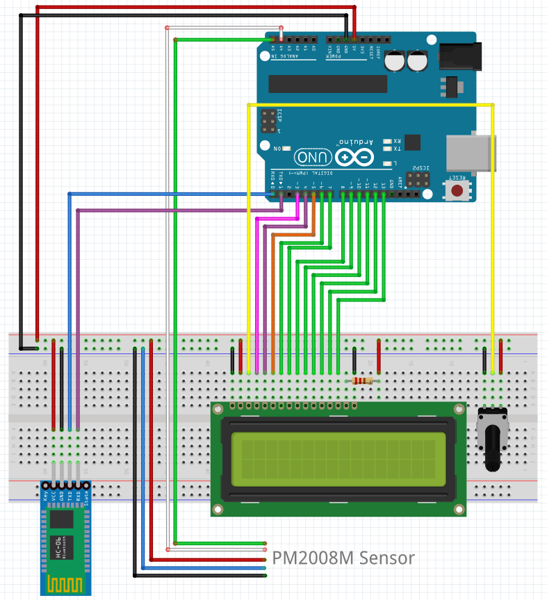

# AVR ATmega328P 미세먼지 측정 장치

실시간 미세먼지 측정 장치

## 목적

창문을 열기 전에 '센서로 측정한 미세먼지 농도'와 '측정소에서 측정한 실시간 미세먼지 농도'를 참고 및 비교하기 위한 장치가 필요하였음

## 프로젝트 기간

- 2023.09.26 ~ 2023.10.22

## 개발환경

### 하드웨어

- Arduino Uno Rev3 (ATmega328P)
- AVRISP-mk2

### 소프트웨어

- Docker
- Code::Blocks

### 프로그래밍 언어

- C
- Python

---

## 사용한 모듈

| No  | 이름 | 모델 | 통신 | 구매 링크 |
|:---:|---|:---:|:---:|:---|
|1|블루투스|HC-06|UART|https://smartstore.naver.com/openidea/products/4834257629|
|2|LCD|LCD 1602A |-|https://www.11st.co.kr/products/1661429267|
|3|미세먼지 센서|PM2008M|I2C|https://www.devicemart.co.kr/goods/view?no=12240662|

## 사용한 부품

1. 포텐셔미터 10K Ω 
2. 220 Ω

## 회로도

## 주요 핵심 기능

- 미세먼지 측정 센서로부터 미세먼지 농도 데이터 수집
- 측정소에서 측정한 실시간 미세먼지 농도 데이터 수집 (선택)
- 수집한 데이터를 LCD 모듈에 출력

## 애자일 보드
https://picayune-grain-85b.notion.site/224e38d7bea74b039d2c1446faa2da46?v=c638c84afa1f4a2bac370afd46f9b77b&pvs=4

## 이슈
https://picayune-grain-85b.notion.site/Issue-a71684448afe4ad4b9753eec6cec158c?pvs=4